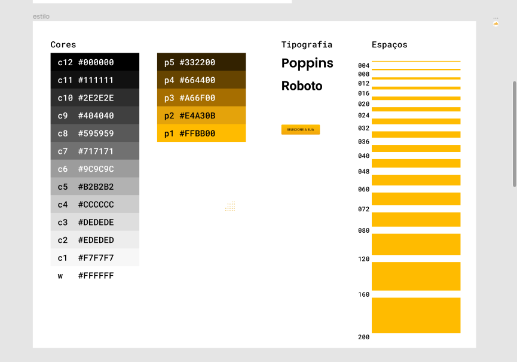

# Bikcraft


Site de uma loja de bicicletas elétricas. Projeto realizado durante o cruso da Origamid.

Você pode visitar uma versão do site pelo link:
[Bikcraft](https://afraniocaires.github.io/bikcraft)

## Design guide

Está incluso, neste repositório, um [arquivo do figma](./Figma/bikcraft-figma.fig) com o guide de design.




## Tecnologias

As seguintes ferramentas foram usadas na construção do projeto:

- HTML
- CSS
- JS

O site foi feito dando ênfase no HTML e CSS, utilizando o mínimo de javaScript, sendo utilizado somente quando necessário.

## Como contribuir?

- Faça um fork do projeto ou clone do projeto:

```bash
# Clone este repositório
$ git clone <https://github.com/AfranioCaires/bikcraft.git>

# Acesse a pasta do projeto no terminal/cmd
$ cd bikcraft
```

- Envie um PR para o repositório
